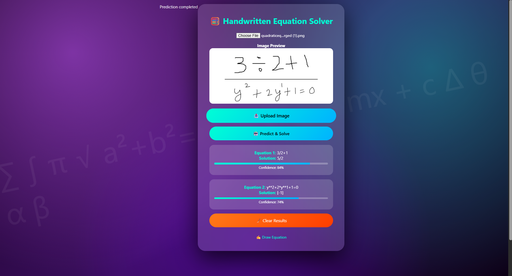
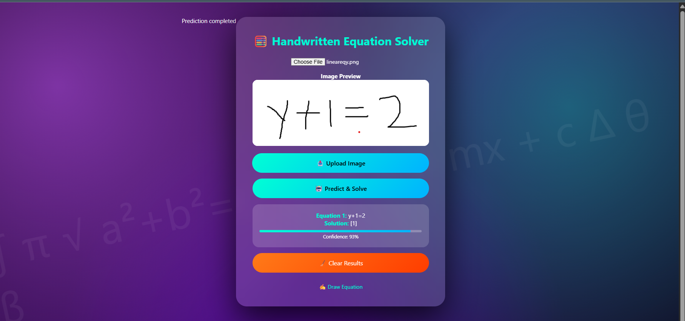
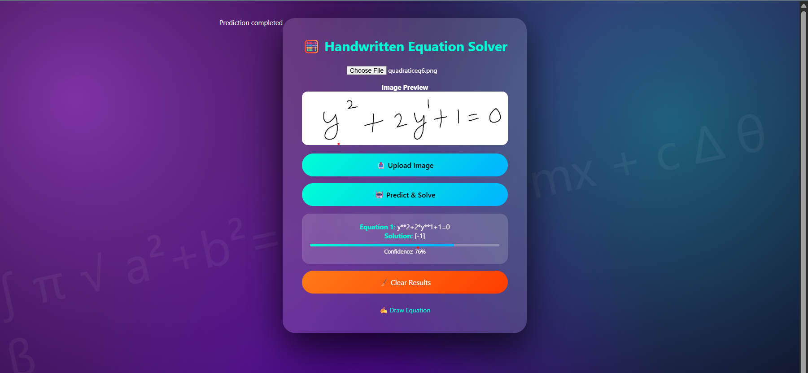

# Handwritten Mathematical Equation Recognition and Solving Using CNN

## 📌 Project Overview
This project presents a **Handwritten Mathematical Equation Recognition and Solving System** built using **Convolutional Neural Networks (CNN)** and a **Flask-based web application**.

The application allows users to:
- Upload an image of a handwritten mathematical equation **OR**
- Draw an equation directly on a canvas

The system recognizes the handwritten equation using a trained CNN model and then **displays the corresponding mathematical expression and its solution**.

Due to the vast scope of mathematics, this project focuses on a **limited subset of symbols**, including:
- Digits: **0–9**
- Arithmetic operators: **+, −, ×, ÷**
- Character: **y**

---

## 🎯 Key Features
- Handwritten equation recognition using CNN
- Canvas-based equation input
- Image upload support
- User-friendly Flask web interface
- Mathematical expression solving
- Modular and extensible design

---

## 🧠 Technologies Used
- **Programming Language:** Python  
- **Deep Learning:** Convolutional Neural Networks (CNN)  
- **Frameworks & Libraries:**
  - TensorFlow / Keras
  - NumPy
  - OpenCV
  - Pillow
- **Web Framework:** Flask  
- **Frontend:** HTML, CSS, JavaScript  
- **Tools:** VS Code, Git, GitHub  

---

## 🗂️ Project Structure
Handwritten-Mathematical-Equation-Recognition-Using-CNN/
│
├── dataset/ # Handwritten symbol dataset (not included)
├── model/ # Trained CNN model files
├── static/ # CSS, JS, images
├── templates/ # HTML templates
│ ├── index.html
│ ├── homepage.html
│ ├── uploadimage.html
│ └── canvasimage.html
│
├── app.py # Flask application
├── train.py # CNN training script
├── test.py # Model testing script
├── requirements.txt # Python dependencies
├── README.md # Project documentation
└── .gitignore


## 🖼️ Screenshots

### Home Page


### Canvas Input


### Recognized Output


---

## ⚙️ How the System Works
1. User uploads or draws a handwritten mathematical equation
2. Image preprocessing (grayscale, resizing, normalization)
3. CNN extracts features and classifies symbols
4. Symbols are combined into a valid mathematical expression
5. The equation is evaluated and the solution is displayed

---

## 📊 Dataset
The project uses a publicly available handwritten mathematical symbols dataset.

🔗 **Download Dataset:**  
https://www.kaggle.com/datasets/xainano/handwrittenmathsymbols

**Symbols included:**
- Digits (0–9)
- Operators (+, −, ×, ÷)
- Character (y)

⚠️ Dataset is not included in the repository to keep it lightweight.

---

## 🚀 Installation & Execution

### 1️⃣ Clone the Repository
```bash
git clone https://github.com/dharshand697/Handwritten_math_solver.git
cd Handwritten_math_solver
2️⃣ Install Dependencies
bash
Copy code
pip install -r requirements.txt
3️⃣ Run the Application
bash
Copy code
python app.py
Open your browser and go to:

cpp
Copy code
http://127.0.0.1:5000/


🔮 Future Enhancements
Support for complex mathematical expressions

Integration with LaTeX rendering

Mobile-friendly UI

Improved accuracy using RNN/Transformer models

Support for regional handwritten symbols

👨‍💻 Author
Dharshan D
GitHub: https://github.com/dharshand697

📜 License
This project is developed for educational and academic purposes only.
